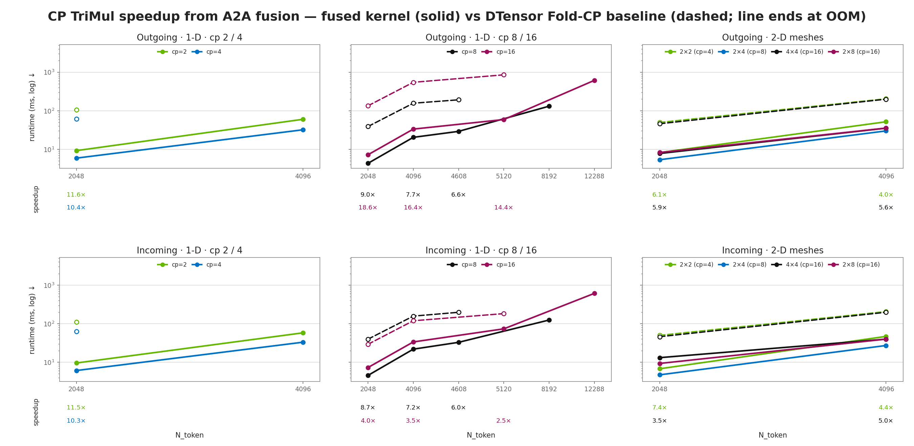

# fold-cp-ops

Context-parallel kernels for co-folding / structure-prediction models, written in
[CuTe-DSL](https://docs.nvidia.com/cutlass/latest/media/docs/pythonDSL/cute_dsl_general/dsl_introduction.html)
and [nvshmem4py](https://docs.nvidia.com/nvshmem/api/latest/api/language_bindings/python/index.html)

The headline op is the **A2A-fused distributed TriMul**: the two all-to-all reshards that a
context-parallel triangle multiplication normally needs are *fused into the GEMM epilogues* rather than
run as separate collectives, so the communication rides the store instead of serializing against it.
A single-device (cp=1) path is included and is selected automatically.



Across all 24 cells where both paths completed, the A2A-fused path measured **2.5–18.6× faster**. It
also completed 16 more cells where the PyTorch CP baseline OOMed or lacked non-square-mesh support.
Speedups are paired ratios from the same interleaved runs, but remain directional because GPU/NIC
metrics perturb the timeline; cross-node measurements used the NVSHMEM CPU-proxy fallback. See the
[benchmark data](profiling/distributed/trimul/dlc_composite_k_dtensor_cp_le16/summary.csv) and
[provenance and caveats](profiling/distributed/trimul/dlc_composite_k_dtensor_cp_le16/PROVENANCE.md).

## Copyright and License Compliance
- The context parallel kernel code is licensed under the terms and conditions as written in [the license file](LICENSE)

- This product includes material from [quack](https://github.com/Dao-AILab/quack/tree/main/quack), licensed under the Apache License, Version 2.0. The Apache license applies to that upstream material; it does not replace the MIT license applicable to NVIDIA-authored portions except where otherwise indicated (See the [third-party-attr.txt](licenses/third-party-attr.txt)) <!-- debrand-allow-upstream-name -->

- This project will download and install additional third-party open source software projects. Review the license terms of these open source projects before use

## Hardware

**SM90 only — H100 / H200.** Not a temporary gap: the fused kernels are `*Sm90` throughout and the
package raises an explicit error on other architectures rather than failing deep in a dispatch:

```
fold-cp-ops requires SM90 (H100/H200); got sm_100.
The SM100/SM120 GEMM kernels are not part of this package.
```

## Install

Python ≥ 3.10, CUDA 13, SM90. Three commands, in this order:

```bash
pip install -e '.[dev]'                                                                # 1
pip install --force-reinstall torch==2.13.0 --index-url https://download.pytorch.org/whl/cu130 # 2
pip install --no-deps nvidia-nvshmem-cu13==3.7.0                                       # 3
pre-commit install
```

**Step 1 alone gives you a broken environment, silently.** This project pins
`nvidia-nvshmem-cu13==3.7.0`; torch declares `nvidia-nvshmem-cu13==3.4.5`. Handed both, pip resolves
the contradiction by **moving torch** — a clean resolve lands on **torch 2.9.1 with the CUDA-12
stack**, exit code 0, no warning. Adding `--extra-index-url .../cu130` does not change this, and
neither does installing torch first: pip downgrades an already-installed 2.13 just the same.

So step 2 puts the CUDA-13 torch back (it drags nvshmem down to 3.4.5 as its own dependency), and
step 3 forces our pin over torch's with `--no-deps` — the override is the whole point, and `--no-deps`
is the only way pip will express it.

The distributed path also needs the loader pointed at the wheel's NVSHMEM, or `libnvshmem_host.so.3`
is not found at all:

```bash
export LD_LIBRARY_PATH="$(python -c 'import sysconfig; print(sysconfig.get_paths()["purelib"])')/nvidia/nvshmem/lib:$LD_LIBRARY_PATH"
```

Verify:

```bash
python -c "import torch, cutlass, importlib.metadata as m; import nvshmem.core; \
  print(torch.__version__, torch.version.cuda, cutlass.__version__, m.version('nvidia-nvshmem-cu13'))"
# 2.13.0+cu130 13.0 4.4.2 3.7.0
```

`docker/Dockerfile` does the same override from an NGC base, and `docker/image_gate.py` fails the
build if any pin has drifted or torch has been moved.

## Use

The whole API, end to end. This block is **extracted from this file and executed verbatim** by
`tests/distributed/workflows/run_readme_tutorial.py` — at the shape written below, not a reduced
one — so every line of it, including the teardown, is a claim that is run rather than reviewed.

It is a launched script, not a pytest test: the block calls `initialize()` / `init_nvshmem()` /
`cleanup()`, and a second nvshmem runtime cannot come up inside a process tree that already holds one.

**Requires `torchrun` or `srun`.** Plain `python script.py` raises and tells you this.

torchrun — one node, 8 GPUs (`cp=8`, NVLink):

```bash
PYTHONPATH=$PWD torchrun --nproc_per_node=8 \
    tests/distributed/workflows/run_readme_tutorial.py
```

srun — two nodes, 16 GPUs (`cp=16`, InfiniBand):

```bash
PYTHONPATH=$PWD srun -N2 --ntasks-per-node=8 \
    python tests/distributed/workflows/run_readme_tutorial.py
```

`cp` is whatever the launcher gives you. `--nproc_per_node=1` is a supported single-GPU case: nvshmem
is never brought up and the cp=1 kernel runs.

```python
import math
import os
from collections import OrderedDict

import torch
import torch.nn as nn
from torch.distributed.tensor import DTensor, Shard

from fold_cp_ops.distributed import DistributedManager
from fold_cp_ops.distributed.workflows.trimul_autotuned import TriangularMultiplication

# 0 ── the shapes. `cp` is the number of ranks the token grid is sharded over; under `torchrun`
#      that is WORLD_SIZE. N must divide by each cp axis and by 8 (bf16 x 8 = the 16-byte TMA
#      floor); D must divide by cp.
B, N, D = 1, 4096, 256

# 0b ─ how cp is SHAPED. None = flat 1-D over every rank. A tuple factors the token grid, e.g.
#      (2, 4) shards rows over 2 and columns over 4; its product must equal cp, and N must divide
#      by EACH axis. Both axes are token axes -- the feature dim is never sharded here.
cp_grid = None

# 1 ── process group, cp mesh, nvshmem. Once per process. Also sets THIS rank's CUDA device, hence
#      `dm.device` below and never "cuda". TWO PHASES: `initialize()` takes NO grid, so it derives
#      world size from torchrun's RANK or srun's SLURM_*; sizing it from os.environ is the bug.
DistributedManager.initialize(device_type="cuda")
DistributedManager.init_nvshmem()
dm = DistributedManager()
cp = dm.world_size                                # DERIVED from the launcher, never guessed
assert cp_grid is None or math.prod(cp_grid) == cp, f"cp_grid {cp_grid} must multiply to cp={cp}"
DistributedManager.create_grid_group(OrderedDict(cp=cp_grid or cp))

# A FACTORED spec puts the factorisation on a SEPARATE subgroups mesh; `dm.device_mesh` stays 1-D
# (cp,) either way. Picking the wrong one silently runs a 1-D geometry and still reports success,
# so select the subgroups mesh when it exists and assert the shape actually asked for.
mesh = dm.device_mesh_subgroups if cp_grid else dm.device_mesh
assert tuple(mesh.shape) == (tuple(cp_grid) if cp_grid else (cp,)), f"mesh is {tuple(mesh.shape)}"
placements = [Shard(i + 1) for i in range(mesh.ndim)]   # 1-D: Shard(1); 2-D: Shard(1), Shard(2)

# 1b ── the layer you already have, on this rank's device. WEIGHTS MUST BE BYTE-IDENTICAL ON EVERY
#       RANK — only x and the mask are sharded, and nothing checks this for you. `manual_seed` is
#       what makes it true: default init draws per process, so ranks would differ and be wrong.
torch.manual_seed(0)
layer = nn.Module()                                   # any module with these six submodules
layer.norm_in, layer.norm_out = nn.LayerNorm(D), nn.LayerNorm(D)
layer.p_in, layer.g_in = nn.Linear(D, 2 * D, bias=False), nn.Linear(D, 2 * D, bias=False)
layer.p_out, layer.g_out = nn.Linear(D, D, bias=False), nn.Linear(D, D, bias=False)
layer = layer.to(dm.device).eval()

# 2 ── construct. Everything data-independent is configured HERE: sharding validated, cp peer map
#      built, transport and store variants chosen; `forward` makes no decisions. `placements=`
#      defaults to the convention above — pass it if yours differ, as a disagreement raises.
trimul = TriangularMultiplication(
    layer,                       # any module exposing norm_in/p_in/g_in/norm_out/p_out/g_out
    direction="outgoing",
    device_mesh=mesh,
    distributed_manager=dm,
    dtype=torch.bfloat16,
)

# 2b ── OPTIONAL: pre-compile, so the first forward() does not pay a multi-second JIT.
#       Purely a scheduling choice -- it restricts nothing about what forward() accepts. Deleting
#       this line changes only WHEN the compile happens.
trimul.prepare(n_token=N, batch=B, masked=True)

# 3 ── allocate your own tensors and run. `x_local` / `m_local` are THIS RANK's shards:
#      (B, N/cp0, N/cp1, D) and (B, N/cp0, N/cp1). Pass shape AND stride so `from_local` needs no
#      shape-inference collective.
cp0 = int(mesh.shape[0])
cp1 = int(mesh.shape[1]) if mesh.ndim > 1 else 1
x_local = torch.randn(B, N // cp0, N // cp1, D, device=dm.device, dtype=torch.bfloat16)
m_local = torch.ones(B, N // cp0, N // cp1, device=dm.device, dtype=torch.bfloat16)

gx, gm = (B, N, N, D), (B, N, N)
rowmaj = lambda sh: torch.empty(sh, device="meta").stride()   # contiguous strides, allocates nothing
x = DTensor.from_local(x_local.contiguous(), mesh, placements, shape=torch.Size(gx),
                       stride=rowmaj(gx))
m = DTensor.from_local(m_local.contiguous(), mesh, placements, shape=torch.Size(gm),
                       stride=rowmaj(gm))

out = trimul(x, m)               # DTensor in -> DTensor out, same mesh, same placements
assert out.shape == x.shape and out.placements == x.placements

# 4 ── release, in this order.
trimul.free()                    # releases the COMPILED kernel modules (nvshmem-registered CUDA
                                 # libraries). NOT symmetric memory: that is MemPool-recycled by
                                 # refcount, as COLLECTIVE `nvshmem_free` deadlocks on GC ordering.
DistributedManager.cleanup()     # barrier -> release registered CUDA libraries -> destroy the
                                 # process group. Does NOT finalize nvshmem: a one-way door per
                                 # process, so it runs once from an atexit hook init_nvshmem() sets.
```

There are **no top-level re-exports** — import from the defining module. (Earlier revisions of this
file showed `from fold_cp_ops.distributed import FusedTriMulCP` and
`from fold_cp_ops import trimul_autotuned`; neither name has ever existed, so both raised
`ImportError` on line 1.) The functional form is
`fold_cp_ops.distributed.workflows.trimul_autotuned.trimul_a2a`, and the single-device kernel is
`fold_cp_ops.workflows.trimul_autotune.trimul_autotuned`.

`TriangularMultiplication` is inference-only (`@torch.no_grad`). cp=1 is selected automatically —
a plain tensor, a 1-device mesh, or placements that split no token axis all route to the
single-device kernel without touching nvshmem. For a custom mesh, `PeMap.from_mesh_placements` maps
`(mesh, placements)` to the flat CP peer ordering.

**`DistributedManager.initialize()` is currently required** before the distributed path — `init_nvshmem`
raises without it, even if you already have `torch.distributed` up. Accepting an existing process group
is a known follow-up.

## Environment

Runtime knobs are prefixed `CPO_`. The two you are most likely to need:

| var | effect |
|---|---|
| `CPO_CACHE_ENABLED=0` | disable the persistent `.o` JIT cache for intentional cold-compile measurements. Leave it unset (the default is enabled) for production and correctness so repeated calls reuse compiled artifacts instead of recompiling. This controls the single-device `@jit_cache` sites under `fold_cp_ops/kernels/`; the distributed A2A path uses separate compile machinery |
| `CPO_HEURISTIC_ARCH` | override the arch key used to pick tuned perf thresholds |

Set `CPO_CACHE_ENABLED=0` only when measuring cold compile time. It does **not** clear the autotune
*result* cache, which is a separate on-disk store. That matters for benchmarking: the same code
measured cold vs warm has been observed to differ by ~2× on an autotuning path.

## Testing

```bash
pytest tests/                                                  # single-device
torchrun --nproc_per_node=2 -m pytest tests/distributed/<file>  # distributed
```

Distributed tests are torchrun-collected; world size is the CP width. Leave the JIT cache enabled
unless the test explicitly measures cold compile time.

## Known limitations

These are real and documented rather than discovered later:

- **Cold-compile time exceeds 5 s** on many shapes of the TriMul path, badly at large feature widths.
  Inherited, not introduced.
- Three of six benchmark harness targets, the harness CLI, and all shell launchers have no automated
  test coverage.
